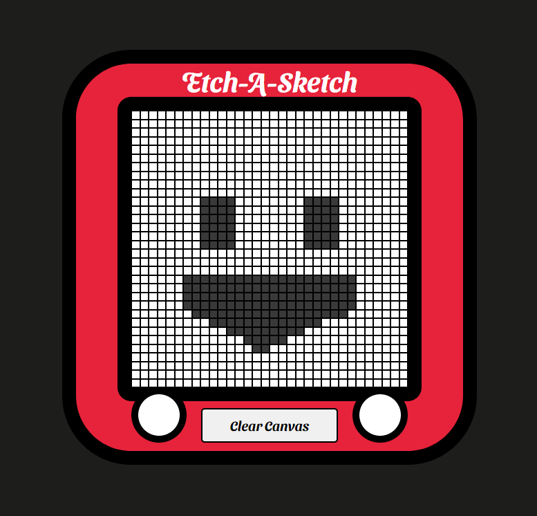
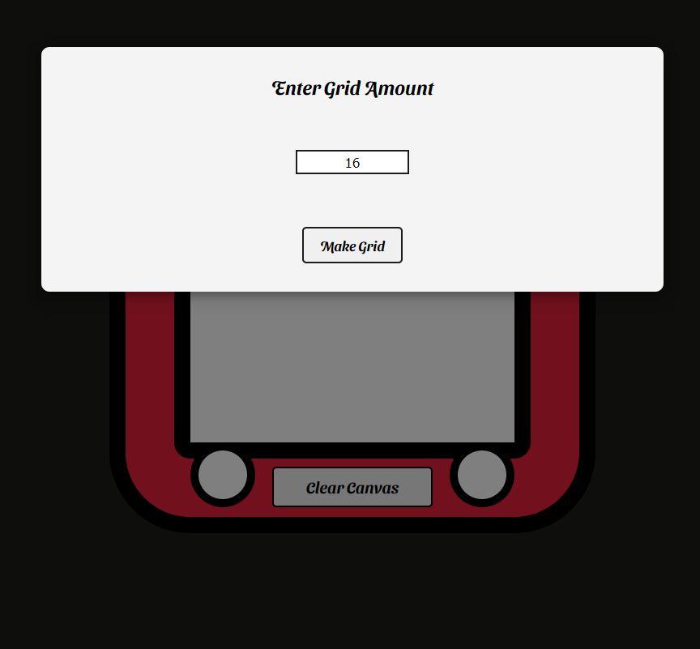

# Etch-A-Sketch

- Web remake of the fun toy from 90's.
- UI Designed by Çetin Çakıroğlu.
- To play, user should enter desired grid amount to the pop-up.
- To start drawing, click once and hover mouse on grids.
- To stop drawing, double click.
- To clean the canvas and reset painting, hit the 'Clear Canvas' button.

---
[Etch-A-Sketch](https://etch-a-sketch-toygame.netlify.app/)

